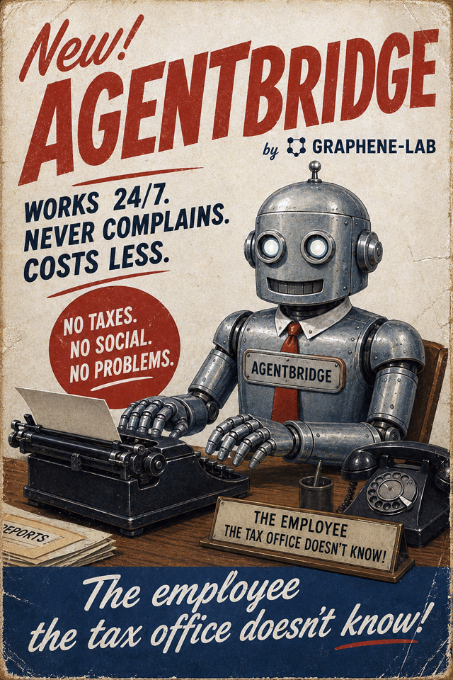
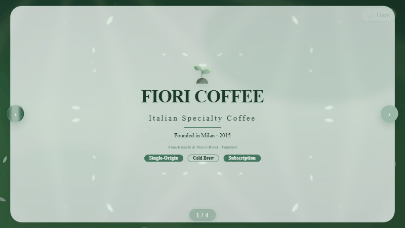
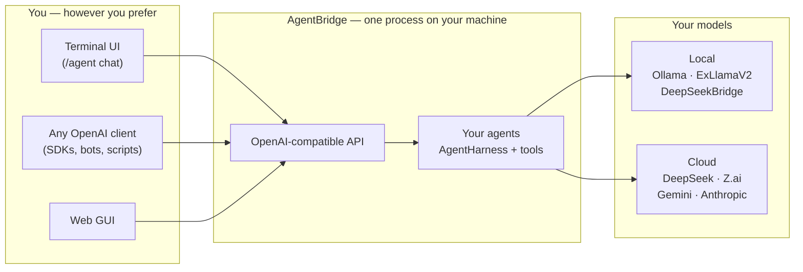
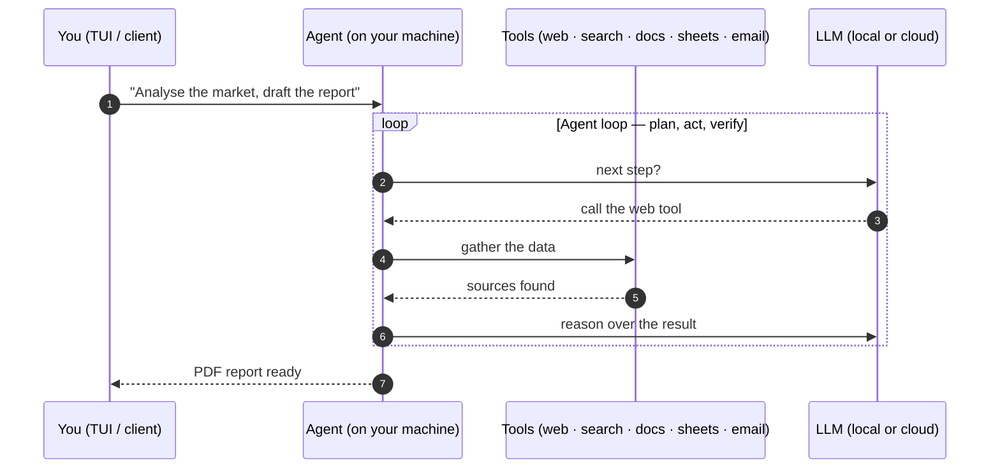

# AgentBridge (codename "AGENT") — promises to replace humans in offices

**Add agentic power to your work! Automate tasks and your work without sacrificing your privacy.
We're happy to put this powerful tool in your hands to automate your business while reducing staff costs, providing you with the most advanced AI technology in the office automation industry.**

AgentBridge is a self-hosted server that runs AI agents with two interfaces in a single process: a full-screen chat terminal (TUI) and a standard HTTP API compatible with OpenAI.

Chat in the terminal while scripts, bots, and apps use the same agents on the same port:
same process, same conversations, no bridges, no synchronization.

**At a glance** — self-contained, ~460 MB per archive (no .NET installation needed, Kokoro
TTS voices included) · 5 platforms: Windows x64, Linux x64/ARM64, macOS Intel/Apple
Silicon · terminal UI in 6 languages · OpenAI-compatible API **and** native MCP ·
deterministic memory · application-level sandbox · GDPR-ready anonymization · reachable
24/7 via SIP phone and Telegram.



> **Why teams choose this architecture**  
> AgentBridge is built on the AIOrchestrator library model: one runtime, one agent core, and one consistent operational flow across terminal and API. The result is faster execution, lower integration overhead, and stronger control than traditional multi-server MCP setups. Read the white paper: [Why the AIOrchestrator Library Model Outperforms Traditional MCP Deployments](docs/AIORCHESTRATOR-WHITEPAPER.md).

## Install & download

[](https://graphenelab.it/AgentBridge/download/)
[](https://github.com/Graphene-Lab/AgentBridge/releases/latest)

The **Download for your OS** button detects your platform and starts the right archive
(~460 MB, self-contained — no .NET installation needed, Kokoro TTS voices included).
Prefer the terminal? One line is enough:

| Platform | One-line install |
|---|---|
| **Windows** (PowerShell) | `irm https://graphenelab.it/AgentBridge/install.ps1 \| iex` |
| **Linux / macOS** | `curl -fsSL https://graphenelab.it/AgentBridge/install.sh \| bash` |

The one-liners download the latest release for your platform into `~/.agentbridge`
(`%LOCALAPPDATA%\AgentBridge` on Windows) and print how to start it. Direct links:

[](https://github.com/Graphene-Lab/AgentBridge/releases/latest/download/agentbridge-win-x64.tar.gz)
[](https://github.com/Graphene-Lab/AgentBridge/releases/latest/download/agentbridge-linux-x64.tar.gz)
[](https://github.com/Graphene-Lab/AgentBridge/releases/latest/download/agentbridge-linux-arm64.tar.gz)
[](https://github.com/Graphene-Lab/AgentBridge/releases/latest/download/agentbridge-osx-x64.tar.gz)
[](https://github.com/Graphene-Lab/AgentBridge/releases/latest/download/agentbridge-osx-arm64.tar.gz)

Built on the [AIOffice](https://github.com/Graphene-Lab/AIOffice) agent orchestrator
(`AIOrchestrator`), AgentBridge brings the agents to **everything**:

- **You, in the terminal** — a modern chat UI (Terminal.Gui) with streaming replies, a `/`
  command palette, file attachments, voice dictation and in-process neural text-to-speech.
- **Any OpenAI-compatible client** — SDKs, bots and scripts talk plain
  `POST /v1/chat/completions` to the same agents. No plugin, no custom SDK, no lock-in.

## Demo gallery

A visual showcase — new demos are added here as they are produced.

**Terminal UI** — streaming agent replies, the `/` command palette with live filtering, and
the status bar that follows the server, model, session and context window:


**PowerPoint-style presentations generated by the agent** — describe the deck you need and
the agent designs the slides for you:




**Detailed PDF market & financial analysis reports generated by the agent** — request a market analysis, financial analysis, or report of any kind and the agent will use proprietary "AI Exoskeleton" augmented artificial intelligence algorithms to generate accurate PDF documents with authoritative sources such as Deloitte, KPMG, E&Y, etc.:


**Real office documents generated from a plain prompt** — ask for an invoice or an employment contract, attach the data, and the agent produces the finished document from the official templates, ready to use in the office. These two were generated end-to-end by the agent (material check → DOCX) in a real use case:


This is an employment contract in Word format, completely generated by the agent with a simple request. The AI agent has no limitations; it can create any type of document, remember the style and maintain it for future use, or modify it if necessary to customize it or add new elements.


An Excel spreadsheet (data table + chart, single A4 page) created by the agent on request from a plain prompt — the user asks for a workbook in English, the agent builds it with the SpreadsheetTool (data, styles, chart, A4 page setup) and delivers the finished file:


## Agent Bridge: Your AI Assistant for Office Work

Agent Bridge is a tool that allows you to connect to your preferred AI, transforming it into your personal assistant: a tireless worker capable of handling office tasks such as drafting complex documents, working with spreadsheets, interacting with email, and performing internet-based activities—all while having full awareness of your company's knowledge base: clients, documents, products, and everything stored in your archive.

Agent Bridge positions itself as an enterprise-grade AI automation platform for businesses or private individuals seeking AI solutions. It runs on your own hardware — a laptop, a mini PC, or a dedicated AI box — and the knowledge base it reads is a plain folder on disk, not a cloud upload: everything you already store there becomes part of the AI's understanding, enabling it to work as a tireless employee and carry out office work. The product fits within the enterprise segment, capable of indexing and managing even several terabytes of data — while your files never leave your machine — and can generate PDF documents with a level of detail and precision that is unmatched.

Our **Agentic AI** is designed to be installed on standalone devices, such as mini PCs and dedicated AI hardware, effectively transforming them into truly autonomous agents. An agentic system, in fact, is not simply meant to execute a task on command but is built to pursue a complex objective with full autonomy, and its key characteristics go well beyond running a single instruction. First and foremost, it possesses planning and reasoning capabilities: when faced with a request like "organize a trip to Tokyo," the system does not merely react but breaks the goal down into a series of logical sub-goals, such as booking a flight, selecting a hotel, and creating a coherent itinerary. This planning phase is then put into action through the active use of external tools: the agent is capable of calling APIs, executing code, searching the internet, and interacting with databases or other applications to independently gather information and take action. To manage this level of complexity, the system maintains a structured memory, both short-term and long-term, of the actions taken and the information collected, allowing it to adapt its plan along the way. Its operation is based on a continuous loop of execution and feedback: it performs an action, observes the result – for instance, an error during a flight search – evaluates whether this result is bringing it closer to the final goal, and accordingly adjusts its next step. This cycle of action, observation, and adaptation continues until the objective is fully achieved. Our hardware support strategy targets a range of devices, starting with high-performance processors like the **16-core AMD Ryzen AI Max+ 395**, the **12-core AMD Ryzen AI 9 HX 370**, the **NVIDIA GB10 Grace Blackwell Superchip**, the **14-core Arm-based NVIDIA Jetson T5000**, and the **20-core NVIDIA RTX Spark**. For the entry-level segment, we maintain compatibility with ARM-based technology, specifically supporting the **Rockchip RK3588**, **Rockchip RK3576**, **Qualcomm Snapdragon 865**, **Qualcomm Snapdragon X2 Elite**, **MediaTek Genio 420**, and **MediaTek Genio 360** chipsets.

## Innovative Features

- **Proprietary Deterministic Memory — the Agent Never Forgets**
  A proprietary deterministic memory keeps the agent permanently aware of the things, facts,
  people and documents it has already handled: every conversation leaves a trace, and every new
  request instantly brings back the precise relevant context. No other system on the market does
  this: conventional agents try to "remember" by re-elaborating context through the model itself,
  while our memory retrieves deterministically — zero reasoning iterations wasted on recollection,
  a faster workflow, and an agent that is always lucid and grounded in everything it has already
  worked on. This original, proprietary algorithm is exclusive to AgentBridge and places it at
  the top of the agentic sector with highly innovative technology.

- **AI Assistant Available 24/7 via SIP Protocol**
  The system provides a fully integrated AI agent that can be reached at any time through SIP‑based telephone access. It operates as a dedicated personal assistant capable of natural voice interaction, immediate task execution, and uninterrupted availability. Unlike a human secretary who may be distracted or unavailable, this assistant remains consistently focused, reliable, and committed to carrying out assigned duties with precision.

- **Full Telegram Integration — Your Agents on Your Messenger**
  AgentBridge connects to Telegram as a user account (WTelegramClient, MTProto) and behaves like any other chat client: send a private message — text or files — and the agents reply in the same chat, including the documents they produce. Attachments are supported both ways, first login is guided from the TUI (verification code), an optional allow-list restricts who can talk to the agent, and the configuration lives in `telegram.json` (editable from the TUI, by hand, or with the guided setup scripts). See [docs/telegram.md](docs/telegram.md).

  

- **AI‑Exoskeleton Technology for Enhanced Model Performance**
  Our proprietary AI‑Exoskeleton framework significantly amplifies the capabilities of AI models while reducing bias in complex document processing. Just as an exoskeleton enables a human to lift weights far beyond natural limits, AI‑Exoskeleton empowers smaller models to outperform frontier‑scale systems in specific office workflows. It strengthens analytical consistency, improves the accuracy of business reports and technical documentation, and produces ready‑to‑use PDF outputs with exceptional reliability. This technology transforms artificial intelligence into a genuinely augmented professional tool capable of sustaining cognitive workloads that would normally require specialized human teams.

- **True Application‑Level Sandbox — Agents Cannot Act Outside Their Tools**
  Every agent operates inside a virtual workspace path that acts as a real sandbox: a limited action perimeter that no tool method can breach. The agent's only way to touch the world is through its tool methods — no shell, no OS API, no direct network, no filesystem access beyond what a tool explicitly exposes — so the perimeter is enforced structurally by code, not by prompt instructions that a crafted input could bypass. Competing systems either trust the prompt alone (defeatable by injection) or require expensive OS‑level sandboxes (chroot, Docker, VMs) that a common user cannot set up. Here the sandbox is application‑level and zero‑infrastructure, yet absolute: powerful inside its perimeter, harmless outside it.

- **GDPR‑Ready Anonymization — Privacy by Design for External Providers**
  A robust anonymization service protects personal data — names, keys and sensitive identifiers — before any request reaches an external LLM provider (Copilot, Gemini, ChatGPT, DeepSeek and more), and restores it seamlessly in the reply. It is enabled with a single switch, adds no perceptible latency to agentic interactions, and is completely transparent to the user: the agent keeps its full power while the machine never exposes what should stay private. This makes the platform a strong fit for the European market, where GDPR compliance is a hard requirement.

- **Universal Tool System (UTS) — Tools That Run Natively, Not as Scripts**
  Our Universal Tool System gives the AI its abilities through **plugins that are compiled .NET assemblies** the agent drives directly — no Python, no Node, no interpreter, and no framework stack to install. Deterministic intelligence (UISupportGeneric) reads the compiled code and builds the tool interface **on the fly**, exactly and without hallucination; the generative AI then picks and drives the right tool. The result is a **faster, more responsive AI**: tools run as native machine code — modern .NET compilers rival hand-tuned C/C++ — and are called **in-process with zero overhead**, with no interpreters, no HTTP and no serialization between the agent and its actions. The machine stays light, answers come back sooner, and the heaviest jobs finish faster — all inside a **native application‑level sandbox** (a structural action perimeter that no tool method can breach) that needs no chroot, Docker or VMs. Tools are **universal** — a single AnyCPU binary runs on Windows, Linux, macOS and iOS — and are installed by simply dropping a folder into `Tools/`, with **hot‑add**: new plugins are activated live, 30 seconds after they appear, without a restart. End‑user guide: [Universal Tool System (UTS)](https://github.com/Graphene-Lab/AgentHarness/blob/master/docs/universal-tool-system.md).

- **Native MCP Interoperability — One Agent, Standard Control**
  AgentBridge now exposes its autonomous runtime through a native MCP interface, so the same production agent can be controlled from standard MCP clients without external adapter layers. This means one orchestrator, one memory flow and one operational perimeter across terminal chat, OpenAI-compatible integrations and MCP ecosystems. In practice, teams can adopt AgentBridge as a high-capability agent core while preserving protocol-level compatibility and reducing integration complexity.

- **Autonomous Task Scheduling — Your Agent Keeps Working on Its Own**
  AgentBridge doesn't just act on command: it can plan work ahead and continue on its own, according to the real needs of your business. Tell it what matters, and it remembers deadlines, decides when it is time to act, and handles recurring duties on a preset cadence — day after day, without anyone having to ask twice. Reports, checks, follow-ups and scheduled activities all proceed on time, even while you are away: the agent schedules the work, carries it out automatically and records the outcome. A true always-on colleague, not a tool that waits for instructions.

## Your documents area: the company's brain and memory

Think of the documents area as your company's brain. It is a simple folder on disk — nothing special, just a place where your files already live. Whatever you put in it, the AI can read, remember and use: contracts, invoices, client files, product sheets, emails, spreadsheets, technical drawings... everything. It does not matter how much data you have or how big the files are: the more you store, the smarter your AI becomes, because it answers using *your* real documents, not guesses. You never upload anything into the chat — you just keep working with your normal folders, and the AI reaches into them directly.

### How to configure the documents area

1. Open AgentBridge and type `/modelsetup` (menu **File → Models & Providers**).
2. In the **General** tab, set **Documents path** to the folder that holds your documents. The default is your personal Documents folder — you can change it at any time.
3. Press **Save**. AgentBridge starts reading that area in the background: the first indexing of a large archive takes a few minutes, but you can keep working while it runs.
4. From now on, ask the AI anything about your documents — it searches the whole area and answers from your data. If you move to a different folder, just change the path again: AgentBridge automatically re-indexes the new area.

### How to configure the LLM provider and API keys

1. Open AgentBridge and type `/modelsetup` (menu **File → Models & Providers**).
2. In the **LLM & Providers** tab, pick the active provider; use **Add…** / **Edit…** to
   create or edit a provider. The provider dialog includes an **API key** field (masked on
   screen) — every cloud provider (DeepSeek, Z.ai, Gemini, Anthropic, …) needs its key;
   local providers (Ollama, ExLlamaV2, bridges on `localhost`/`127.0.0.1`) leave it empty.
3. Press **Save**. Keys are stored per-provider in `providers.json` next to the executable
   (the single source of truth, excluded from updates) — you can also edit that file
   directly. The manual ([§3 — Configure the JSON files](docs/MANUAL.md#3-configure-the-json-files))
   documents every field.

## Comparison with Main Alternative Products

| Product | Target Audience | Key Strength | Main Integrations |
| :--- | :--- | :--- | :--- |
| **Agent Bridge** | Businesses and individuals | Self-hosted all-in-one AI agent platform | Preferred AI, company archives |
| **Claude for Small Business** | Small businesses | Ready-to-use workflows for operational tasks | QuickBooks, PayPal, HubSpot, Canva, DocuSign |
| **Microsoft Scout** | Microsoft 365 companies | Autonomous, proactive AI agent always active | Outlook, Teams, SharePoint, OneDrive |
| **Nono CoWork** | Power users and developers | Proactive agent always active on VPS | Email, synced folders, Telegram |
| **171305 Cowork** | Power users and developers | Local AI workspace, privacy-first | Gmail, Calendar, Drive, Sheets, Ollama |
| **Templafy** | Large enterprises | Platform for compliant, branded documents | Office, CRM, Claude, Copilot, ChatGPT |

## What you can do with it

- **Chat with AI agents from the terminal** — streaming replies, `@` file attachments,
  prompt history, sessions, all in a full-screen UI with a command palette.
- **Multilingual UI** — the terminal UI runs in the system language when supported
  (English, Italian, French, Spanish, German, Russian) and falls back to English otherwise;
  system messages from the orchestrator are localised too (see [docs/TUI.md](docs/TUI.md#localisation)).
- **Open the web GUI in one keystroke** — `/web` (menu **Web → GUI**) launches the Giraffe AI
  web client in the browser, already connected to this server (the client installs itself next
  to the executable on first run from its latest GitHub release and stays up to date).
- **Expose the agents as a local OpenAI server** — point any OpenAI client at
  `http://localhost:5290/v1` and it drives the agents without modification (see the
  [manual](docs/MANUAL.md#connecting-a-client-to-localhost)).
- **Expose the agents through the native MCP connector** — use standard MCP clients with
  the same runtime already used by terminal and OpenAI API flows (technical setup in
  [manual](docs/MANUAL.md#mcp-connector-standard-json-rpc)).
- **Switch the LLM on the fly** — DeepSeek, Z.ai, Gemini, Ollama, ExLlamaV2 and more, with
  a context-window guard that refuses an overflow and explains why.
- **Per-provider agent interaction mode** — each provider can drive the agent tools via the
  JSON tool-calling API (`API`) or the application CLI (`CLI`), or leave it `Default` (CLI
  for small models, API for large ones). Set it in the provider dialog under **Models &
  Providers**; the active mode is shown on the status page and reported by `GET /v1/models`
  as `interaction_mode`.
- **Configure models & providers from the UI** — `/modelsetup` (menu **File → Models &
  Providers**) adds, edits or removes providers, picks the active model, sets the
  per-provider API keys, SMTP/IMAP and documents path — no JSON editing required.
- **Voice in the terminal** — dictate from the server microphone (Windows) and hear the
  replies spoken by Kokoro neural TTS, in the UI and over the API.
- **SIP telephony** — the server becomes a phone endpoint: auto-answer behind a DTMF PIN
  (3 attempts, 24 h lockout), outgoing calls, and full voice conversations with the agents
  over RTP (whisper STT + Kokoro TTS). See [docs/sip.md](docs/sip.md).
- **Telegram chat** — private-chat messaging with the agents, attachments both ways,
  allow-list access control and TUI-guided first login (WTelegramClient userbot).
  See [docs/telegram.md](docs/telegram.md).
- **Upload-and-attach files** — documents and images converted to Markdown server-side,
  attached to chat requests as `file_ids`.
- **Agents with tools** — web, search, research, document, spreadsheet, office, email and
  multi-files sets; pick the right tools per chat with `/agent` or the API `model` field
  (any custom tool combination via the additive `tools` field).
- **One conversation everywhere** — messages from the terminal go through the exact same
  endpoint any client uses, so you can chat in the TUI while a script keeps driving the
  agents on the same port, simultaneously.

## Quick start

Run the one-line install above — or download the archive for your platform from the
[Releases page](https://github.com/Graphene-Lab/AgentBridge/releases), extract and run
`agent.exe` / `agent`.
No .NET installation needed; each archive already includes the Kokoro TTS voices and model.

```bash
curl http://localhost:5290/health   # {"status":"healthy","timestamp":"..."}
```

The full step-by-step guide — installation, JSON configuration, the terminal UI and how a
client connects to localhost — is in the **[user manual](docs/MANUAL.md)**.

## Documentation

| Document | Audience / contents |
|---|---|
| [User manual](docs/MANUAL.md) | **Start here.** Install, configure the JSON files, use the terminal UI, connect a client |
| [Terminal UI reference](docs/TUI.md) | Every command, shortcut and mouse action |
| [HTTP API reference](docs/API.md) | All endpoints: chat, sessions, LLM switching, TTS, voice, files, MCP connector |
| [SIP telephony](docs/sip.md) | Phone-gate the agents: config, PIN/allow-list security, NAT/trunk, STT deployment |
| [Telegram chat](docs/telegram.md) | Connect the agents to Telegram: config, first login, allow-list, attachments |
| [Architecture & operations](docs-dev/ARCHITECTURE.md) | *(developers — not shipped)* Launch modes, configuration keys, build & publish, project layout |
| [Releases & NuGet pipeline](docs-dev/RELEASING.md) | *(developers — not shipped)* how updates and releases work |

The user guides above (`docs/`) ship next to the executable in every release archive;
the developer guides (`docs-dev/`) stay in the repository only.

## How it works

`AIOrchestrator` is a .NET library — it cannot run alone. AgentBridge hosts it and exposes
its chat pipeline as a standard web API. **One process. Your machine. Your agents.**



**The agents do the work — locally, under your control:**



**Your data stays yours.** Agents run on your machine inside an application-level sandbox;
only the model call leaves it — and only when you pick a cloud provider. With local models,
nothing leaves at all.

## FAQ

- **What is AgentBridge?** A self-hosted server that runs AI agents behind a full-screen
  terminal chat and a standard OpenAI-compatible HTTP API — one process, your machine,
  your agents, plus a native MCP connector for standard MCP clients.
- **Is AgentBridge free?** The download is free and the source is released as open source
  for personal use under the [Andrea Bruno License 1.4](LICENSE.md); commercial use of the
  code requires a royalty agreement with the author.
- **Which LLMs does it support?** DeepSeek, Z.ai, Gemini, Anthropic and any
  OpenAI-compatible endpoint — plus local models via Ollama, ExLlamaV2 or a local bridge,
  switchable on the fly.
- **Does it work offline?** Yes — with a local model, nothing leaves your machine at all.
- **Do my documents leave my machine?** No. The documents area is a plain local folder the
  agent reads; only the model call leaves the machine, and only when you pick a cloud
  provider. A GDPR-ready anonymization switch strips names and identifiers before any
  external call and restores them in the reply.
- **How is it different from an MCP server?** It exposes a native MCP connector and goes
  further: tools run in-process as compiled .NET plugins inside an application-level
  sandbox, with no separate servers, interpreters or HTTP hops.
- **What hardware does it need?** From a Raspberry Pi / Rockchip RK3588-class device up to
  a Ryzen AI Max+ 395, NVIDIA GB10 or Jetson — see the
  [hardware section](#agent-bridge-your-ai-assistant-for-office-work).
- **Do I need to install .NET?** No — every archive is self-contained (~460 MB) and
  already includes the Kokoro TTS voices and model.

---

Built on the [AIOffice](https://github.com/Graphene-Lab/AIOffice) ecosystem ·
[AgentBridge](https://github.com/Graphene-Lab/AgentBridge) repository.
