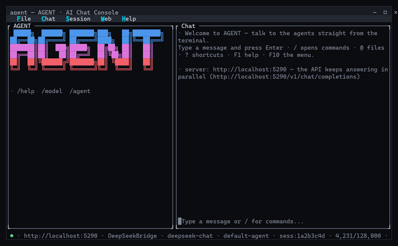

# AgentBridge (codename "AGENT") — AI agents in your terminal and via an OpenAI-compatible API

**AgentBridge is a self-hosted .NET server that runs AI agents with two faces in one
process: a full-screen terminal chat (TUI) and a standard OpenAI-compatible HTTP API.**
Chat in the terminal while scripts, bots and apps drive the same agents on the same port —
same process, same conversations, no bridge, no sync.

## Install & download

[](https://graphenelab.it/AgentBridge/download/)
[](https://github.com/Graphene-Lab/AgentBridge/releases/latest)

The **Download for your OS** button detects your platform and starts the right archive
(~460 MB, self-contained — no .NET installation needed, Kokoro TTS voices included).
Prefer the terminal? One line is enough:

| Platform | One-line install |
|---|---|
| **Windows** (PowerShell) | `irm https://graphenelab.it/AgentBridge/install.ps1 \| iex` |
| **Linux / macOS** | `curl -fsSL https://graphenelab.it/AgentBridge/install.sh \| bash` |

The one-liners download the latest release for your platform into `~/.agentbridge`
(`%LOCALAPPDATA%\AgentBridge` on Windows) and print how to start it. Direct links:

[](https://github.com/Graphene-Lab/AgentBridge/releases/latest/download/agentbridge-win-x64.tar.gz)
[](https://github.com/Graphene-Lab/AgentBridge/releases/latest/download/agentbridge-linux-x64.tar.gz)
[](https://github.com/Graphene-Lab/AgentBridge/releases/latest/download/agentbridge-linux-arm64.tar.gz)
[](https://github.com/Graphene-Lab/AgentBridge/releases/latest/download/agentbridge-osx-x64.tar.gz)
[](https://github.com/Graphene-Lab/AgentBridge/releases/latest/download/agentbridge-osx-arm64.tar.gz)

Built on the [AIOffice](https://github.com/Graphene-Lab/AIOffice) agent orchestrator
(`AIOrchestrator`), AgentBridge brings the agents to **everything**:

- **You, in the terminal** — a modern chat UI (Terminal.Gui) with streaming replies, a `/`
  command palette, file attachments, voice dictation and in-process neural text-to-speech.
- **Any OpenAI-compatible client** — SDKs, bots and scripts talk plain
  `POST /v1/chat/completions` to the same agents. No plugin, no custom SDK, no lock-in.

## Demo

The terminal UI in action — streaming agent replies, the `/` command palette with live
filtering, and the status bar that follows the server, model, session and context window:



## Agent Bridge: Your AI Assistant for Office Work

Agent Bridge is a tool that allows you to connect to your preferred AI, transforming it into your personal assistant: a tireless worker capable of handling office tasks such as drafting complex documents, working with spreadsheets, interacting with email, and performing internet-based activities—all while having full awareness of your company's knowledge base: clients, documents, products, and everything stored in your archive.

Agent Bridge positions itself as a cloud platform for businesses or private individuals seeking AI solutions. Everything uploaded to the cloud area becomes part of the AI's knowledge, enabling it, with full understanding of your documents and data, to work as a tireless employee and carry out office work. The product fits within the enterprise segment, capable of storing and managing even several terabytes of data, and can generate PDF documents with a level of detail and precision that is unmatched.

Our **Agentic AI** is designed to be installed on standalone devices, such as mini PCs and dedicated AI hardware, effectively transforming them into truly autonomous agents. An agentic system, in fact, is not simply meant to execute a task on command but is built to pursue a complex objective with full autonomy, and its key characteristics go well beyond running a single instruction. First and foremost, it possesses planning and reasoning capabilities: when faced with a request like "organize a trip to Tokyo," the system does not merely react but breaks the goal down into a series of logical sub-goals, such as booking a flight, selecting a hotel, and creating a coherent itinerary. This planning phase is then put into action through the active use of external tools: the agent is capable of calling APIs, executing code, searching the internet, and interacting with databases or other applications to independently gather information and take action. To manage this level of complexity, the system maintains a structured memory, both short-term and long-term, of the actions taken and the information collected, allowing it to adapt its plan along the way. Its operation is based on a continuous loop of execution and feedback: it performs an action, observes the result – for instance, an error during a flight search – evaluates whether this result is bringing it closer to the final goal, and accordingly adjusts its next step. This cycle of action, observation, and adaptation continues until the objective is fully achieved. Our hardware support strategy targets a range of devices, starting with high-performance processors like the **16-core AMD Ryzen AI Max+ 395**, the **12-core AMD Ryzen AI 9 HX 370**, the **NVIDIA GB10 Grace Blackwell Superchip**, the **14-core Arm-based NVIDIA Jetson T5000**, and the **20-core NVIDIA RTX Spark**. For the entry-level segment, we maintain compatibility with ARM-based technology, specifically supporting the **Rockchip RK3588**, **Rockchip RK3576**, **Qualcomm Snapdragon 865**, **Qualcomm Snapdragon X2 Elite**, **MediaTek Genio 420**, and **MediaTek Genio 360** chipsets.

## Innovative Features

- **AI Assistant Available 24/7 via SIP Protocol**  
  The system provides a fully integrated AI agent that can be reached at any time through SIP‑based telephone access. It operates as a dedicated personal assistant capable of natural voice interaction, immediate task execution, and uninterrupted availability. Unlike a human secretary who may be distracted or unavailable, this assistant remains consistently focused, reliable, and committed to carrying out assigned duties with precision.

- **AI‑Exoskeleton Technology for Enhanced Model Performance**
  Our proprietary AI‑Exoskeleton framework significantly amplifies the capabilities of AI models while reducing bias in complex document processing. Just as an exoskeleton enables a human to lift weights far beyond natural limits, AI‑Exoskeleton empowers smaller models to outperform frontier‑scale systems in specific office workflows. It strengthens analytical consistency, improves the accuracy of business reports and technical documentation, and produces ready‑to‑use PDF outputs with exceptional reliability. This technology transforms artificial intelligence into a genuinely augmented professional tool capable of sustaining cognitive workloads that would normally require specialized human teams.

- **True Application‑Level Sandbox — Agents Cannot Act Outside Their Tools**
  Every agent operates inside a virtual workspace path that acts as a real sandbox: a limited action perimeter that no tool method can breach. The agent's only way to touch the world is through its tool methods — no shell, no OS API, no direct network, no filesystem access beyond what a tool explicitly exposes — so the perimeter is enforced structurally by code, not by prompt instructions that a crafted input could bypass. Competing systems either trust the prompt alone (defeatable by injection) or require expensive OS‑level sandboxes (chroot, Docker, VMs) that a common user cannot set up. Here the sandbox is application‑level and zero‑infrastructure, yet absolute: powerful inside its perimeter, harmless outside it.

- **GDPR‑Ready Anonymization — Privacy by Design for External Providers**
  A robust anonymization service protects personal data — names, keys and sensitive identifiers — before any request reaches an external LLM provider (Copilot, Gemini, ChatGPT, DeepSeek and more), and restores it seamlessly in the reply. It is enabled with a single switch, adds no perceptible latency to agentic interactions, and is completely transparent to the user: the agent keeps its full power while the machine never exposes what should stay private. This makes the platform a strong fit for the European market, where GDPR compliance is a hard requirement.

- **Universal Tool System (UTS) — Tools That Run Natively, Not as Scripts**
  Our Universal Tool System gives the AI its abilities through **plugins that are compiled .NET assemblies** the agent drives directly — no Python, no Node, no interpreter, and no framework stack to install. Deterministic intelligence (UISupportGeneric) reads the compiled code and builds the tool interface **on the fly**, exactly and without hallucination; the generative AI then picks and drives the right tool. The result is low-level, high‑performance automation: native execution speed, minimal resource consumption, and a **native application‑level sandbox** (a structural action perimeter that no tool method can breach) that needs no chroot, Docker or VMs. Tools are **universal** — a single AnyCPU binary runs on Windows, Linux, macOS and iOS — and are installed by simply dropping a folder into `Tools/`, with **hot‑add**: new plugins are activated live, 30 seconds after they appear, without a restart. End‑user guide: [Universal Tool System (UTS)](https://github.com/Graphene-Lab/AIOrchestrator/blob/master/docs/universal-tool-system.md).

## Your documents area: the company's brain and memory

Think of the documents area as your company's brain. It is a simple folder on disk — nothing special, just a place where your files already live. Whatever you put in it, the AI can read, remember and use: contracts, invoices, client files, product sheets, emails, spreadsheets, technical drawings... everything. It does not matter how much data you have or how big the files are: the more you store, the smarter your AI becomes, because it answers using *your* real documents, not guesses. You never upload anything into the chat — you just keep working with your normal folders, and the AI reaches into them directly.

### How to configure the documents area

1. Open AgentBridge and type `/modelsetup` (menu **File → Models & Providers**).
2. In the **General** tab, set **Documents path** to the folder that holds your documents. The default is your personal Documents folder — you can change it at any time.
3. Press **Save**. AgentBridge starts reading that area in the background: the first indexing of a large archive takes a few minutes, but you can keep working while it runs.
4. From now on, ask the AI anything about your documents — it searches the whole area and answers from your data. If you move to a different folder, just change the path again: AgentBridge automatically re-indexes the new area.

## Comparison with Main Alternative Products

| Product | Target Audience | Key Strength | Main Integrations |
| :--- | :--- | :--- | :--- |
| **Agent Bridge** | Businesses and individuals | Cloud platform for "all-in-one" AI assistant | Preferred AI, company archives |
| **Claude for Small Business** | Small businesses | Ready-to-use workflows for operational tasks | QuickBooks, PayPal, HubSpot, Canva, DocuSign |
| **Microsoft Scout** | Microsoft 365 companies | Autonomous, proactive AI agent always active | Outlook, Teams, SharePoint, OneDrive |
| **Nono CoWork** | Power users and developers | Proactive agent always active on VPS | Email, synced folders, Telegram |
| **171305 Cowork** | Power users and developers | Local AI workspace, privacy-first | Gmail, Calendar, Drive, Sheets, Ollama |
| **Templafy** | Large enterprises | Platform for compliant, branded documents | Office, CRM, Claude, Copilot, ChatGPT |

## What you can do with it

- **Chat with AI agents from the terminal** — streaming replies, `@` file attachments,
  prompt history, sessions, all in a full-screen UI with a command palette.
- **Multilingual UI** — the terminal UI runs in the system language when supported
  (English, Italian, French, Spanish, German, Russian) and falls back to English otherwise;
  system messages from the orchestrator are localised too (see [docs/TUI.md](docs/TUI.md#localisation)).
- **Open the web GUI in one keystroke** — `/web` (menu **Web → GUI**) downloads on first run
  and launches the Giraffe AI web client in the browser, already connected to this server.
- **Expose the agents as a local OpenAI server** — point any OpenAI client at
  `http://localhost:5290/v1` and it drives the agents without modification (see the
  [manual](docs/MANUAL.md#connecting-a-client-to-localhost)).
- **Switch the LLM on the fly** — DeepSeek, Z.ai, Gemini, Ollama, ExLlamaV2 and more, with
  a context-window guard that refuses an overflow and explains why.
- **Per-provider agent interaction mode** — each provider can drive the agent tools via the
  JSON tool-calling API (`API`) or the application CLI (`CLI`), or leave it `Default` (CLI
  for small models, API for large ones). Set it in the provider dialog under **Models &
  Providers**; the active mode is shown on the status page and reported by `GET /v1/models`
  as `interaction_mode`.
- **Configure models & providers from the UI** — `/modelsetup` (menu **File → Models &
  Providers**) adds, edits or removes providers, picks the active model, sets the API keys,
  SMTP/IMAP and documents path — no JSON editing required.
- **Voice in the terminal** — dictate from the server microphone (Windows) and hear the
  replies spoken by Kokoro neural TTS, in the UI and over the API.
- **SIP telephony** — the server becomes a phone endpoint: auto-answer behind a DTMF PIN
  (3 attempts, 24 h lockout), outgoing calls, and full voice conversations with the agents
  over RTP (whisper STT + Kokoro TTS). See [docs/sip.md](docs/sip.md).
- **Upload-and-attach files** — documents and images converted to Markdown server-side,
  attached to chat requests as `file_ids`.
- **Agents with tools** — web, search, research, Word, spreadsheet, email and multi-agent
  sets; pick the right tools per chat with `/agent` or the API `model` field.
- **One conversation everywhere** — messages from the terminal go through the exact same
  endpoint any client uses, so you can chat in the TUI while a script keeps driving the
  agents on the same port, simultaneously.

## Quick start

Run the one-line install above — or download the archive for your platform from the
[Releases page](https://github.com/Graphene-Lab/AgentBridge/releases), extract and run
`agent.exe` / `agent`.
No .NET installation needed; each archive already includes the Kokoro TTS voices and model.

```bash
curl http://localhost:5290/health   # {"status":"healthy","timestamp":"..."}
```

The full step-by-step guide — installation, JSON configuration, the terminal UI and how a
client connects to localhost — is in the **[user manual](docs/MANUAL.md)**.

## Documentation

| Document | Audience / contents |
|---|---|
| [User manual](docs/MANUAL.md) | **Start here.** Install, configure the JSON files, use the terminal UI, connect a client |
| [Terminal UI reference](docs/TUI.md) | Every command, shortcut and mouse action |
| [HTTP API reference](docs/API.md) | All endpoints: chat, sessions, LLM switching, TTS, voice, files |
| [Architecture & operations](docs/ARCHITECTURE.md) | Launch modes, configuration keys, build & publish, project layout |
| [SIP telephony](docs/sip.md) | Phone-gate the agents: config, PIN/allow-list security, NAT/trunk, STT deployment |
| [Releases & NuGet pipeline](docs/RELEASING.md) | *(developers)* how updates and releases work |

## How it works

`AIOrchestrator` is a .NET library — it cannot run alone. AgentBridge hosts it and exposes
its chat pipeline as a standard web API:

```
Terminal UI  ──┐
               ├──▶ AgentBridge (this server, one process)
OpenAI client ─┘            │
                            ▼
                     AIOrchestrator (agents + tools)
                            │
                            ▼
     LLMs (DeepSeek · Z.ai · Gemini · Ollama · ExLlamaV2 · ...)
     + agent tools (web, search, Word, spreadsheet, email)
     + Kokoro neural TTS (in-process) + VoiceAgent.Win (Windows speech)
```

---

Built on the [AIOffice](https://github.com/Graphene-Lab/AIOffice) ecosystem ·
[AgentBridge](https://github.com/Graphene-Lab/AgentBridge) repository.
