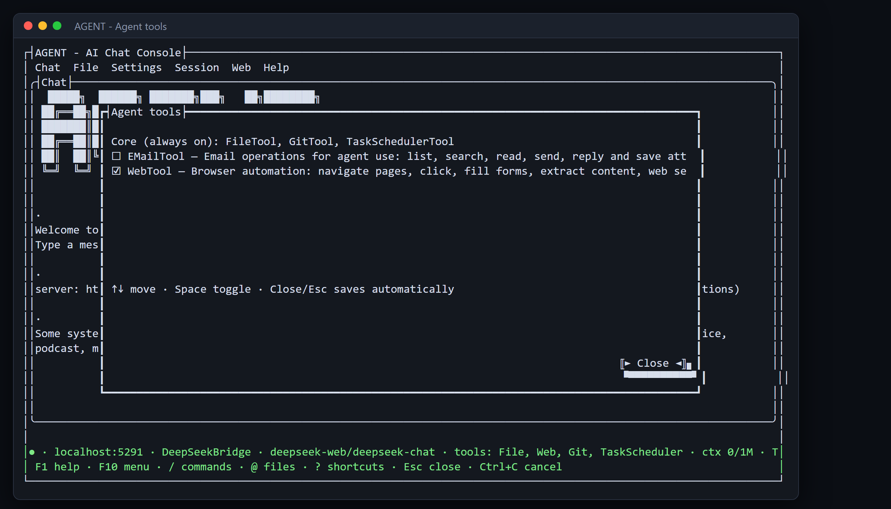

# Turn the right tools on

**Tool:** Tools checklist (/tools) · **How you reach it:** Terminal window

## The situation
Your assistant starts light and quick. When you need a special skill — like making a real Excel file — you switch that tool on for the conversation.

## What you ask the agent
```text
/tools
```



## What AgentBridge does
A simple checklist appears. You move with the arrow keys and tick a tool with the Space bar. Your choice is remembered, so next time the tool is already there. The core tools (files, history, scheduling) are always on.

## Good to know
In a hurry? Type the name of a ready-made set, like /tools spreadsheet-files, and it is switched on in one step.

---
*Part of the **Automate Your Business with AI** example library. The full book is free — see the [examples README](../../README.md).*
