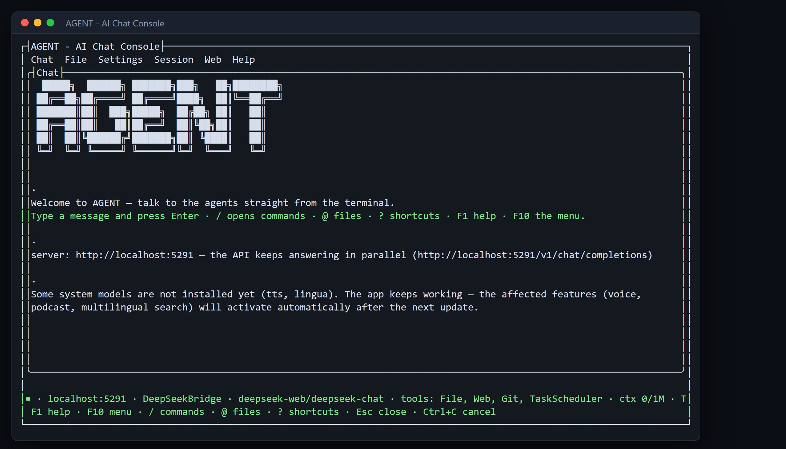

# Your first conversation

**Tool:** AgentBridge TUI · **How you reach it:** Terminal window

## The situation
It is your first day with AgentBridge. You do not need to know anything about AI. You just open the window and type what you would tell a new assistant.

## What you ask the agent
```text
Hello! What can you help me with in my office?
```



## What AgentBridge does
The agent answers in plain words and lists what it can do: write documents, build spreadsheets, read and send email, research the web, make presentations and more. You keep talking to it like a person. Everything happens in this one window.

## Good to know
You never have to memorise anything. Press F1 at any time for help, and the bottom bar always shows what is active.

---
*Part of the **Automate Your Business with AI** example library. The full book is free — see the [examples README](../../README.md).*
