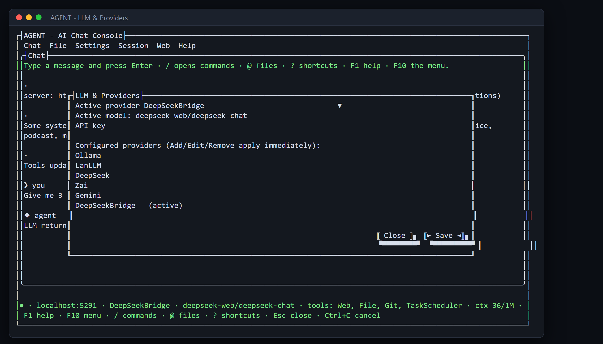

# Choose which AI answers you

**Tool:** Model setup (LLM & Providers) · **How you reach it:** Terminal window

## The situation
You can use a big AI in the cloud or a private one on your own computer. Switching between them takes a few seconds and changes nothing else.

## What you ask the agent
```text
/model
```



## What AgentBridge does
You see your providers and the active model. Pick another one and the whole conversation continues with it. Your documents, tools and history stay exactly where they are — only the answering AI changes.

## Good to know
A local model keeps your data on your own machine. A cloud model is usually sharper. You decide per conversation.

---
*Part of the **Automate Your Business with AI** example library. The full book is free — see the [examples README](../../README.md).*
