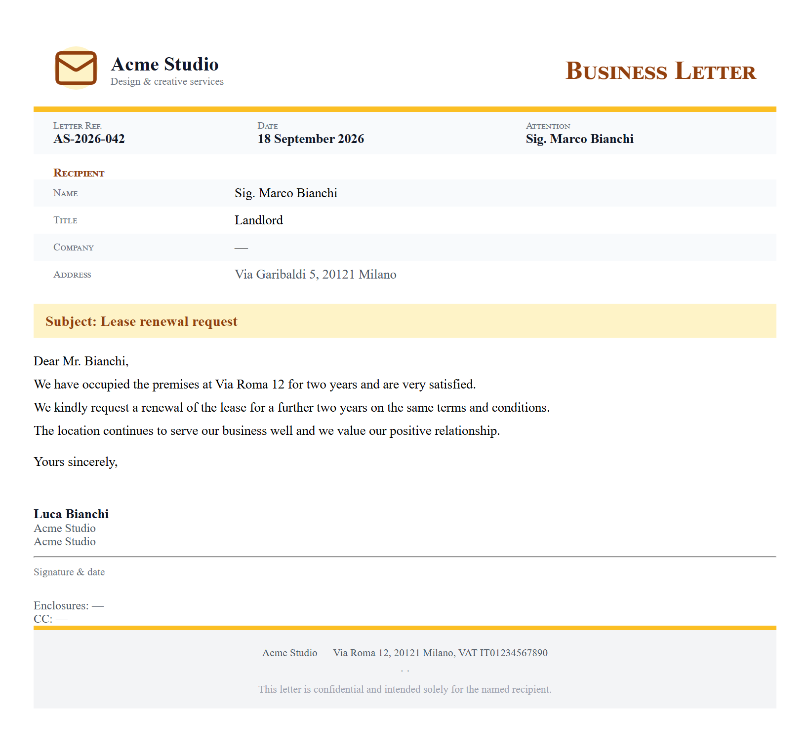

# Write a formal letter

**Tool:** Document tools · **How you reach it:** Chat message

## The situation
You need to send a formal letter — to a landlord, a supplier, a bank. Getting the tone and format right takes time.

## What you ask the agent
```text
Write a formal letter to our landlord asking to renew the lease for another two years on the same terms.
```



## What AgentBridge does
The agent writes the letter with the right greeting, a clear body and a polite closing, in your business voice. You review it, change a word if you like, and send it.

## Good to know
Tell it who you are writing to and what you want; it handles the formal tone for you.

---
*Part of the **Automate Your Business with AI** example library. The full book is free — see the [examples README](../../README.md).*
