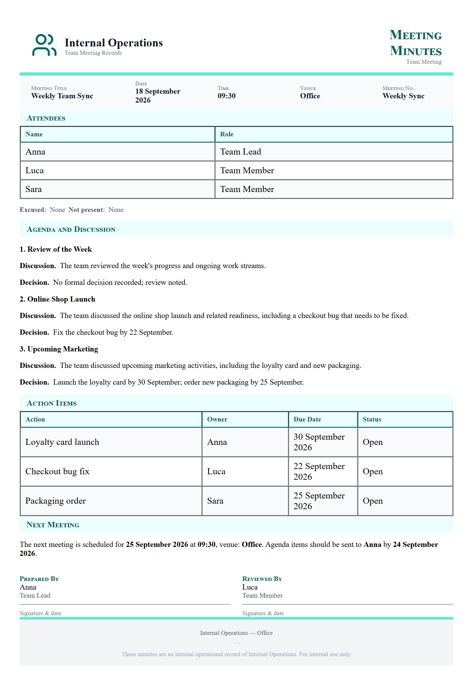

# Clean meeting notes

**Tool:** Document tools · **How you reach it:** Chat message

## The situation
You jotted rough notes during a meeting. Now someone needs clean minutes with the decisions and who does what.

## What you ask the agent
```text
Turn these rough notes into clean meeting minutes with a decisions list and action items: [paste notes]
```



## What AgentBridge does
The agent turns your messy notes into structured minutes: what was discussed, what was decided, and an action list with owners. You can send them straight to the team.

## Good to know
Paste your notes as they are — the agent sorts the order and the wording.

---
*Part of the **Automate Your Business with AI** example library. The full book is free — see the [examples README](../../README.md).*
