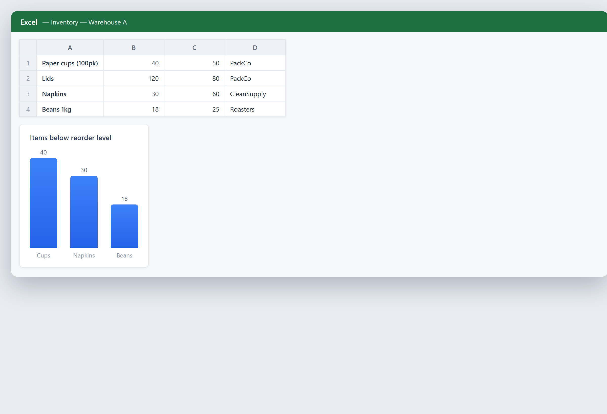

# Keep stock in order

**Tool:** Spreadsheet tools · **How you reach it:** Chat message

## The situation
You need a simple stock list with quantities and reorder levels, so nothing runs out unnoticed.

## What you ask the agent
```text
Make an inventory spreadsheet with item, quantity, reorder level and supplier, and highlight what is below the reorder level.
```



## What AgentBridge does
The agent sets up the inventory sheet and marks the items that need reordering. Update the quantities and ask it to re-check any time.

## Good to know
A weekly scheduled check can tell you what to reorder before you run out.

---
*Part of the **Automate Your Business with AI** example library. The full book is free — see the [examples README](../../README.md).*
