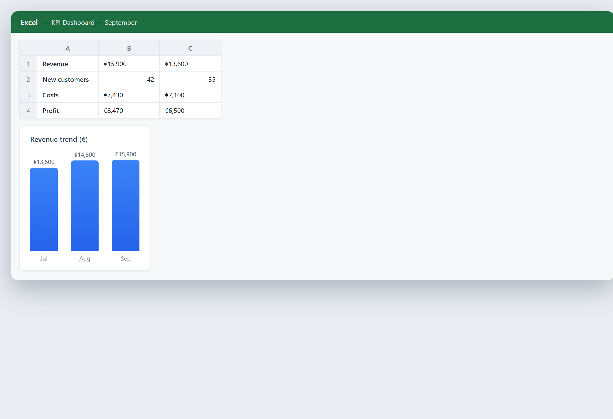

# Your key numbers on one sheet

**Tool:** Spreadsheet tools · **How you reach it:** Chat message

## The situation
You want the few numbers that matter — revenue, customers, costs — together, with a chart you can show your team.

## What you ask the agent
```text
Build a small KPI dashboard: monthly revenue, new customers, cost, and a chart of revenue trend.
```



## What AgentBridge does
The agent lays out the key figures and a trend chart on one clean sheet. It becomes the page you look at every week.

## Good to know
Keep the same sheet updated and ask the agent to compare this month to last month.

---
*Part of the **Automate Your Business with AI** example library. The full book is free — see the [examples README](../../README.md).*
