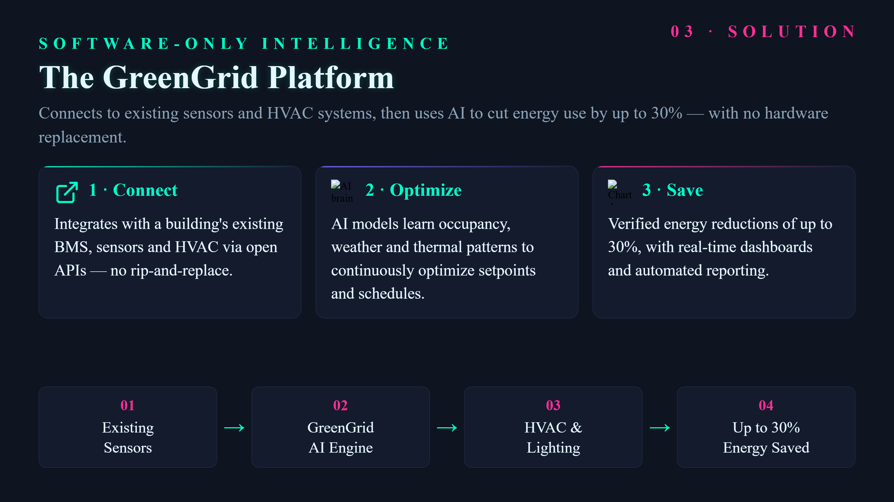

# A pitch deck from one prompt

**Tool:** Presentation tools · **How you reach it:** Chat message

## The situation
You have ten minutes to pitch your idea and no slides. You describe the story and the agent builds the deck.

## What you ask the agent
```text
Make a 6-slide pitch deck for my delivery startup: problem, solution, market, model, traction, ask.
```



## What AgentBridge does
The agent designs the slides with a clean look, one clear idea per slide, and the right order for a pitch. In the browser you press F11 for full screen and present.

## Good to know
Need a real .pptx to send? Use /tools office-files and ask for PowerPoint.

---
*Part of the **Automate Your Business with AI** example library. The full book is free — see the [examples README](../../README.md).*
