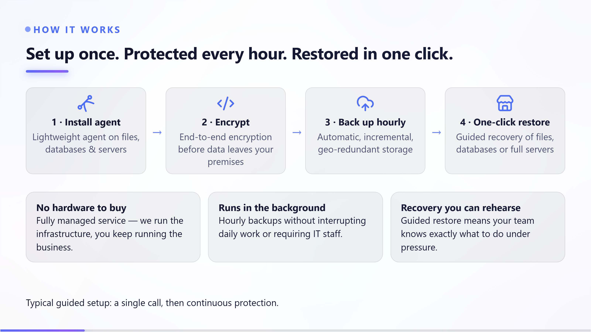

# A client sales deck

**Tool:** Presentation tools · **How you reach it:** Chat message

## The situation
Before a client meeting you want a deck that shows what you did for them and what comes next.

## What you ask the agent
```text
Create a sales deck summarising our work with Acme and proposing the next phase.
```



## What AgentBridge does
The agent builds a focused deck: results so far, what the client gained, and the proposed next step. You tweak the numbers and present with confidence.

## Good to know
Attach the project report and the agent pulls the highlights into the slides.

---
*Part of the **Automate Your Business with AI** example library. The full book is free — see the [examples README](../../README.md).*
