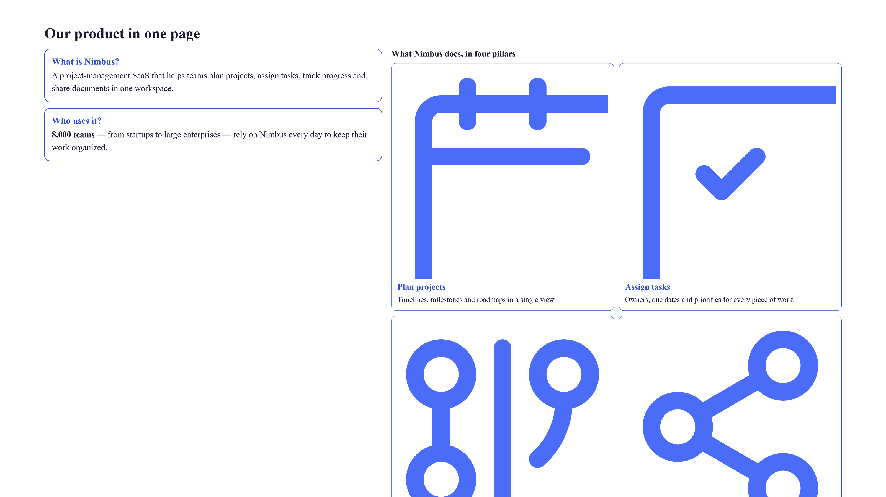

# Train your team fast

**Tool:** Presentation tools · **How you reach it:** Chat message

## The situation
You need to teach your team a new process. A clear slide deck makes the training short and consistent.

## What you ask the agent
```text
Make a training deck on how to handle a customer refund, step by step.
```



## What AgentBridge does
The agent turns the process into clear slides, one step each, easy to follow. Use it for onboarding and refreshers.

## Good to know
Add a final slide with 'who to ask' so people know where to get help.

---
*Part of the **Automate Your Business with AI** example library. The full book is free — see the [examples README](../../README.md).*
