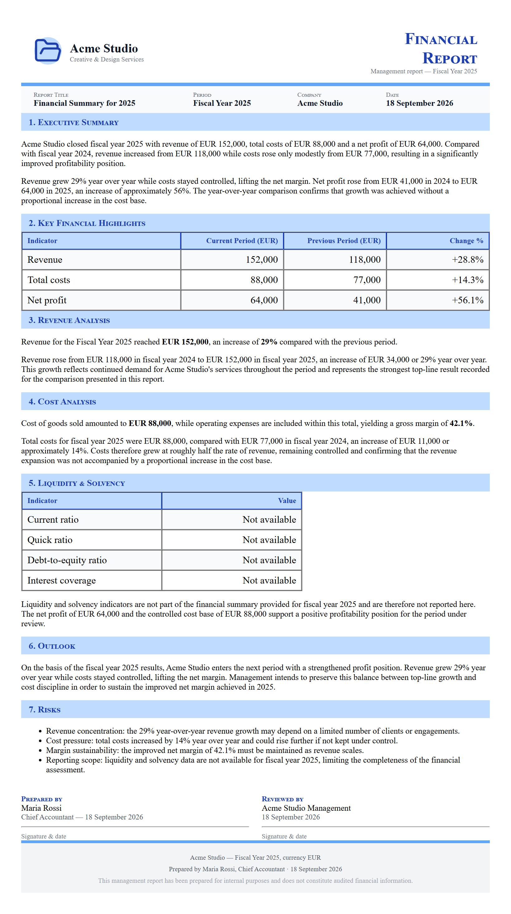

# A financial summary report

**Tool:** Document tools (PDF) · **How you reach it:** Chat message

## The situation
Your accountant asked for a clean summary of the year. You want it as a proper PDF.

## What you ask the agent
```text
Create a PDF financial summary for 2025: revenue, costs, profit and a year-over-year chart.
```



## What AgentBridge does
The agent builds the report with the figures, the trend chart and a plain-language summary of what the numbers mean.

## Good to know
Attach your ledger export and the agent reads the real numbers into the report.

---
*Part of the **Automate Your Business with AI** example library. The full book is free — see the [examples README](../../README.md).*
