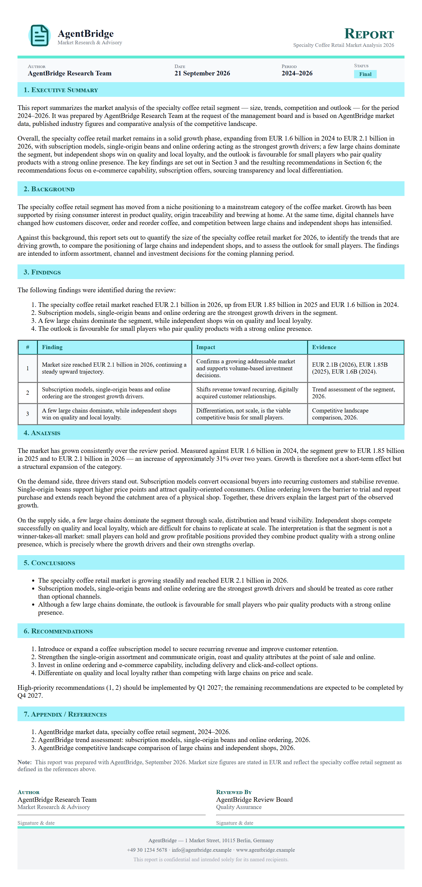

# A market analysis report

**Tool:** Document tools (PDF) · **How you reach it:** Chat message

## The situation
You are thinking of a new product line and want a serious look at the market, with sources, as a PDF.

## What you ask the agent
```text
Produce a PDF market analysis of the specialty coffee retail segment: size, trends, competitors and outlook.
```



## What AgentBridge does
The agent researches the topic and writes a structured PDF report with sections, figures and cited sources — the kind of document that normally takes a consultant days.

## Good to know
Tell it the depth you need. 'Short brief' or 'detailed report' changes the length.

---
*Part of the **Automate Your Business with AI** example library. The full book is free — see the [examples README](../../README.md).*
