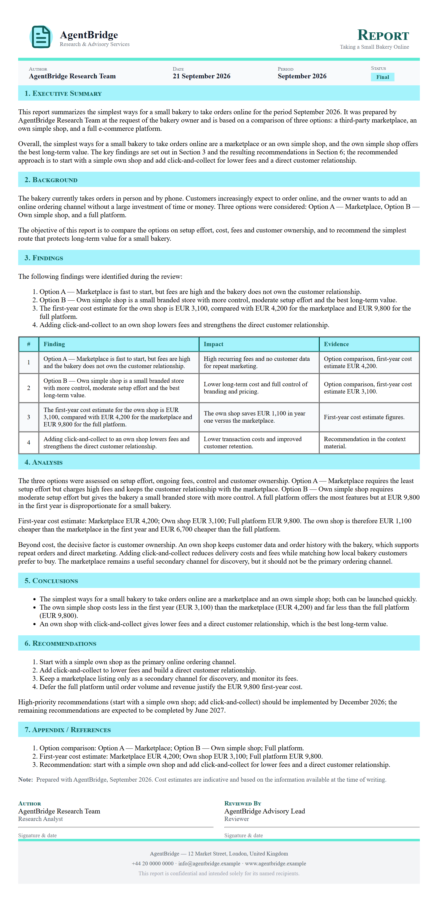

# Research, written up

**Tool:** Document tools (PDF) · **How you reach it:** Chat message

## The situation
You needed answers to a business question and a document to share. Research plus write-up, in one go.

## What you ask the agent
```text
Research the best ways for a small bakery to take orders online and write a PDF report with the options and a recommendation.
```



## What AgentBridge does
The agent searches the web, weighs the options and writes a clear report ending with a practical recommendation you can act on.

## Good to know
Ask it to list the sources so you can check anything yourself.

---
*Part of the **Automate Your Business with AI** example library. The full book is free — see the [examples README](../../README.md).*
