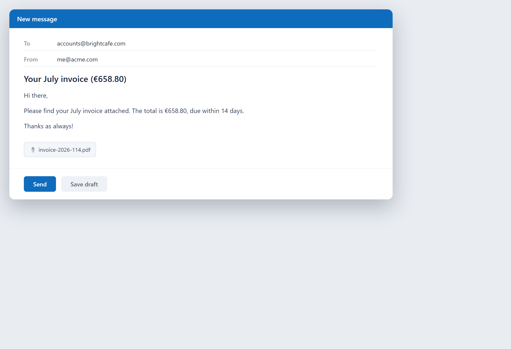

# Send the invoice by email

**Tool:** Email tools · **How you reach it:** Chat message

## The situation
You made the invoice and now it needs to reach the client with a short, clear message.

## What you ask the agent
```text
Email the invoice we just made to the client with a short, friendly cover note.
```



## What AgentBridge does
The agent attaches the invoice and writes a short cover note with the amount and due date. One message, sent.

## Good to know
Chain it: 'make the invoice and email it to the client' in a single ask.

---
*Part of the **Automate Your Business with AI** example library. The full book is free — see the [examples README](../../README.md).*
