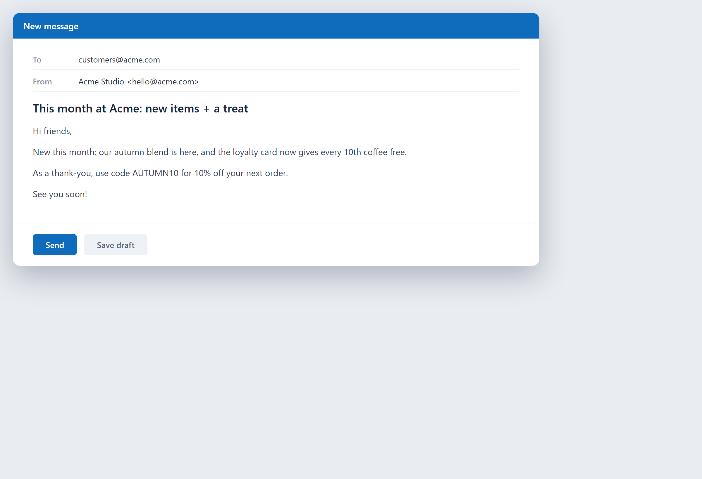

# A customer newsletter

**Tool:** Email tools · **How you reach it:** Chat message

## The situation
You want to keep customers informed with a monthly update, but writing it every month is a chore.

## What you ask the agent
```text
Write a monthly newsletter for our customers: new items, a tip, and a small discount code.
```



## What AgentBridge does
The agent writes the newsletter in your voice with the news, a useful tip and the offer. Send it, or let it prepare one on a schedule.

## Good to know
A monthly scheduled task can draft the newsletter for your review each time.

---
*Part of the **Automate Your Business with AI** example library. The full book is free — see the [examples README](../../README.md).*
