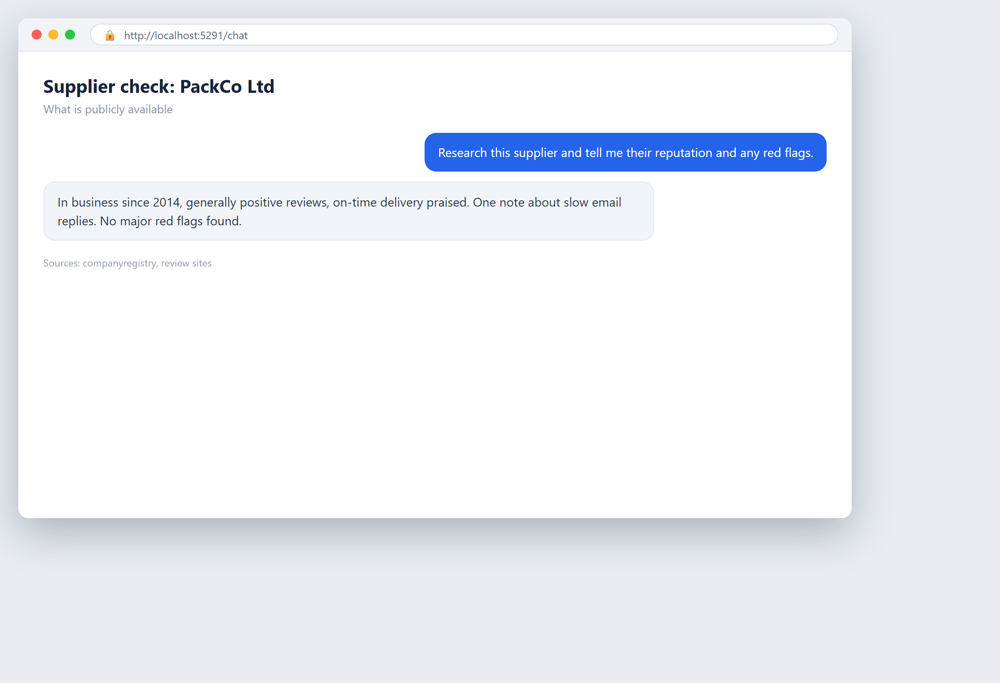

# Check a supplier before you commit

**Tool:** Web research · **How you reach it:** Chat message

## The situation
Before signing with a new supplier you want a quick background check.

## What you ask the agent
```text
Research this supplier and tell me their reputation, how long they have been around, and any red flags.
```



## What AgentBridge does
The agent gathers what is publicly available and gives you a balanced picture with sources, so you decide with your eyes open.

## Good to know
Ask it to list what it could not find, so you know where to dig further.

---
*Part of the **Automate Your Business with AI** example library. The full book is free — see the [examples README](../../README.md).*
