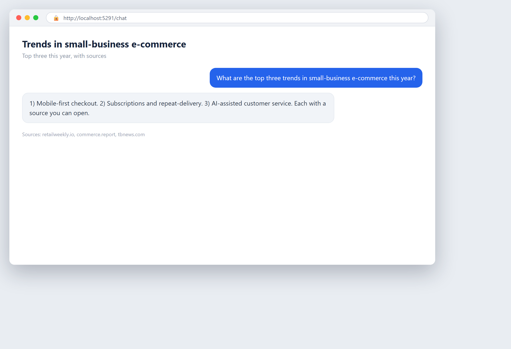

# What is trending in your field

**Tool:** Web research · **How you reach it:** Chat message

## The situation
You want to stay current without reading dozens of articles. You ask for the trends that matter.

## What you ask the agent
```text
What are the top three trends in small-business e-commerce this year? Give me sources.
```



## What AgentBridge does
The agent searches recent articles and gives you the key trends in plain language, each with a source you can open.

## Good to know
A weekly trend digest can be scheduled to keep you current automatically.

---
*Part of the **Automate Your Business with AI** example library. The full book is free — see the [examples README](../../README.md).*
