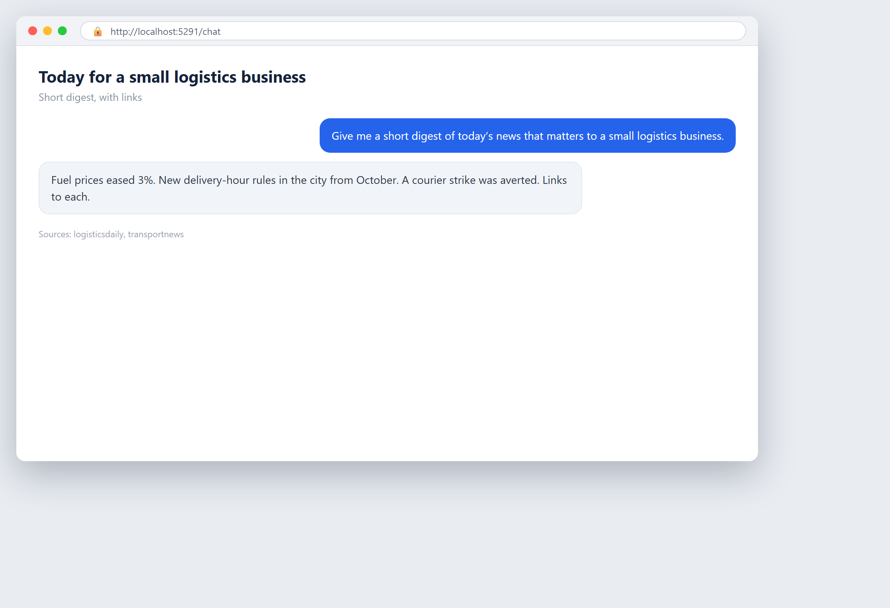

# Your industry news, summarised

**Tool:** Web research · **How you reach it:** Chat message

## The situation
You want the day's relevant news without spending an hour on news sites.

## What you ask the agent
```text
Give me a short digest of today's news that matters to a small logistics business.
```



## What AgentBridge does
The agent scans the news and writes a short digest of what is relevant to you, with links to read more.

## Good to know
Schedule it for every morning and start the day informed.

---
*Part of the **Automate Your Business with AI** example library. The full book is free — see the [examples README](../../README.md).*
