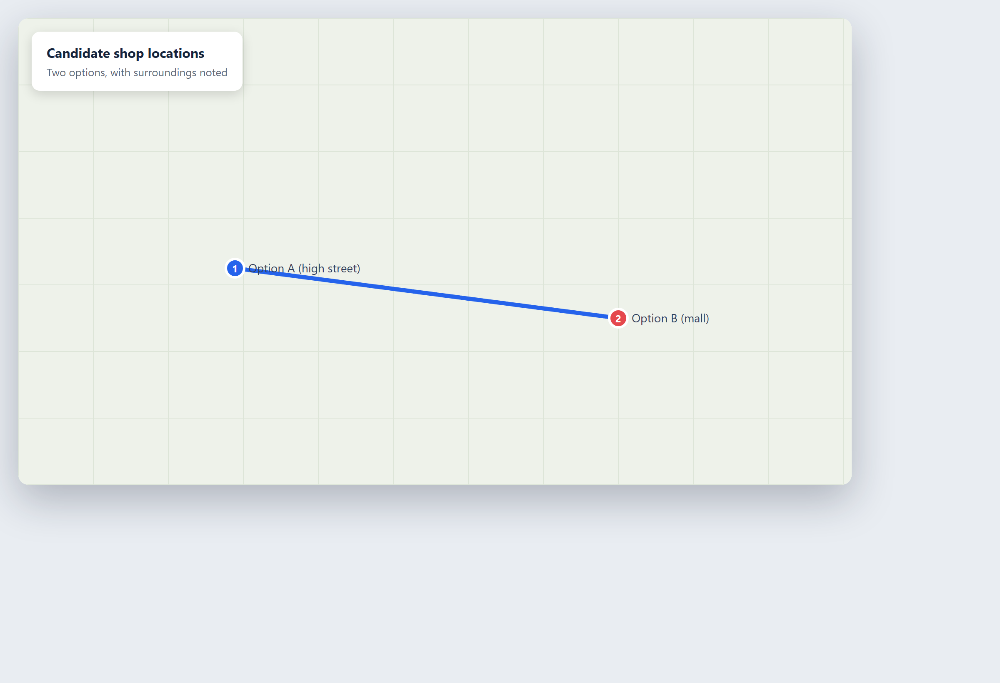

# Where should I open next?

**Tool:** Map tools · **How you reach it:** Chat message

## The situation
You are choosing a shop location and want to think about the area around each option.

## What you ask the agent
```text
Show these two candidate shop locations on a map and note what is near each one.
```



## What AgentBridge does
The agent maps both spots and notes nearby features — foot traffic, competitors, parking — to help you weigh the choice.

## Good to know
Combine this with a web-research step on the neighbourhood for a fuller picture.

---
*Part of the **Automate Your Business with AI** example library. The full book is free — see the [examples README](../../README.md).*
