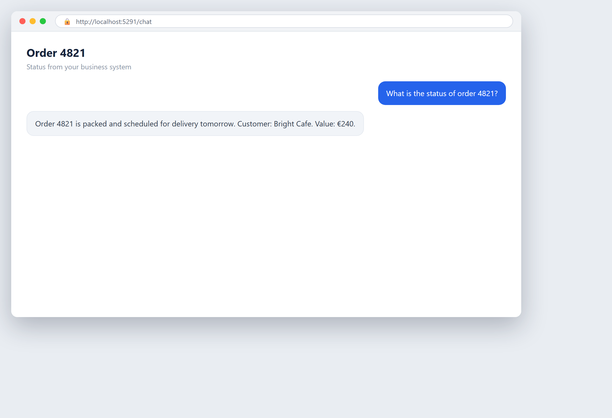

# Check an order in your system

**Tool:** ERP tools · **How you reach it:** Chat message

## The situation
A customer asks where their order is. Instead of clicking through your ERP, you ask the agent.

## What you ask the agent
```text
What is the status of order 4821?
```



## What AgentBridge does
The agent looks up the order in your connected system and tells you its status in plain words — no menu hunting.

## Good to know
This works once your business system is connected. See the book's connecting chapter.

---
*Part of the **Automate Your Business with AI** example library. The full book is free — see the [examples README](../../README.md).*
