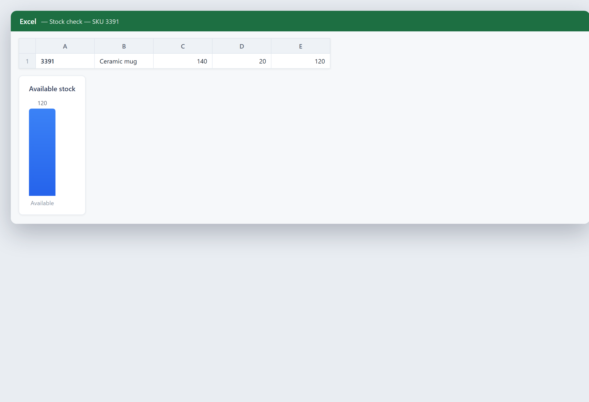

# Is it in stock?

**Tool:** ERP tools · **How you reach it:** Chat message

## The situation
A customer wants to know if an item is available right now.

## What you ask the agent
```text
Do we have item SKU 3391 in stock, and how many?
```



## What AgentBridge does
The agent checks the stock in your system and answers with the quantity, so you can promise or promise-against with confidence.

## Good to know
Pair with a low-stock alert scheduled daily to avoid surprises.

---
*Part of the **Automate Your Business with AI** example library. The full book is free — see the [examples README](../../README.md).*
