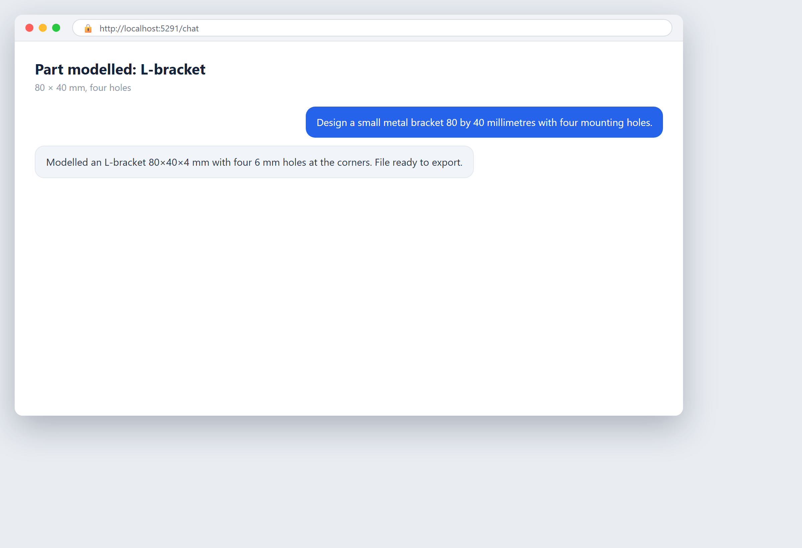

# Design a simple part

**Tool:** CAD tools (FreeCAD) · **How you reach it:** Chat message

## The situation
You need a simple bracket or part and do not want to open a heavy CAD program from scratch.

## What you ask the agent
```text
Design a small metal bracket 80 by 40 millimetres with four mounting holes.
```



## What AgentBridge does
The agent drives the CAD tool to model the part with the right dimensions, and you get a file you can review or export.

## Good to know
Describe the shape and the measurements; the agent handles the CAD steps.

---
*Part of the **Automate Your Business with AI** example library. The full book is free — see the [examples README](../../README.md).*
