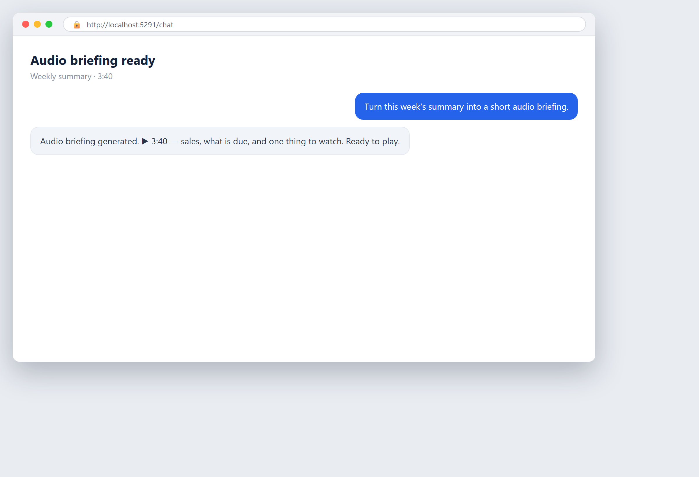

# A briefing you can listen to

**Tool:** Podcast tools · **How you reach it:** Chat message

## The situation
You would rather listen to the weekly update than read it. Turn the report into audio.

## What you ask the agent
```text
Turn this week's summary into a short audio briefing I can listen to on the way to work.
```



## What AgentBridge does
The agent converts the written summary into a clear audio briefing, so your commute becomes useful time.

## Good to know
Schedule the weekly summary and its audio version together.

---
*Part of the **Automate Your Business with AI** example library. The full book is free — see the [examples README](../../README.md).*
