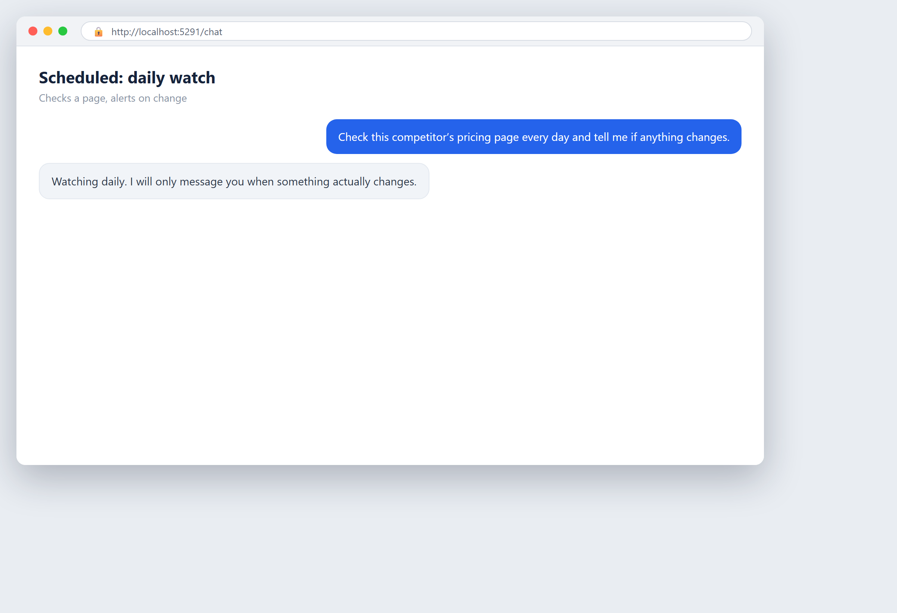

# Watch a page for changes

**Tool:** Scheduled tasks + web · **How you reach it:** Agreed schedule

## The situation
You want to know when a competitor changes their price, without checking by hand.

## What you ask the agent
```text
Check this competitor's pricing page every day and tell me if anything changes.
```



## What AgentBridge does
The agent checks the page on schedule and only messages you when something actually changed. No noise, just the news.

## On a schedule
A daily scheduled watch. It runs alone and reports only when there is something to report.

---
*Part of the **Automate Your Business with AI** example library. The full book is free — see the [examples README](../../README.md).*
