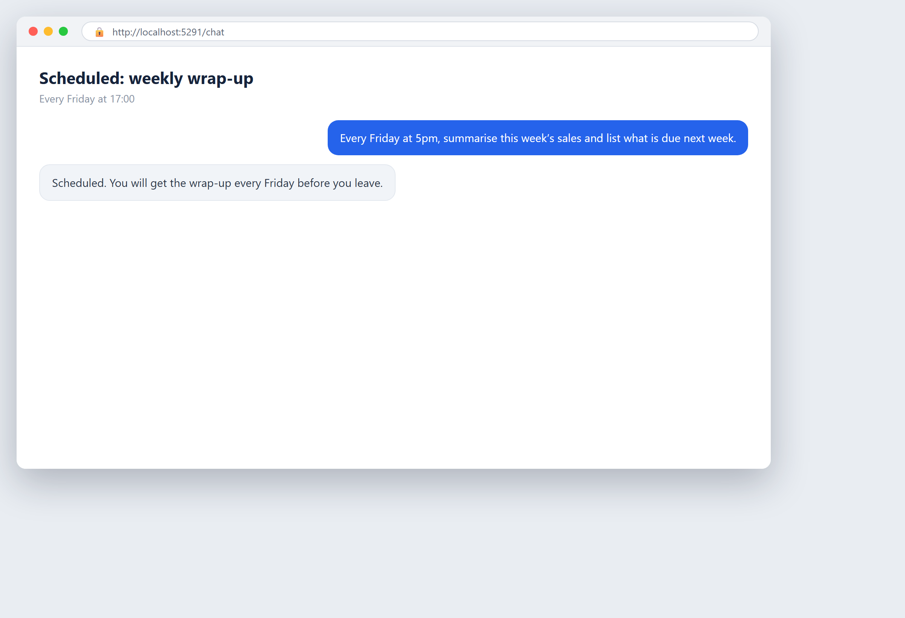

# Your week, wrapped up automatically

**Tool:** Scheduled tasks · **How you reach it:** Agreed schedule

## The situation
Every Friday you want a wrap-up of the week's numbers and what is due next.

## What you ask the agent
```text
Every Friday at 5pm, summarise this week's sales and list what is due next week.
```



## What AgentBridge does
The agent prepares the weekly wrap-up automatically and sends it before you leave. Next week starts with a clear plan.

## On a schedule
A weekly recurring task. AgentBridge handles the timing so you handle the decisions.

---
*Part of the **Automate Your Business with AI** example library. The full book is free — see the [examples README](../../README.md).*
