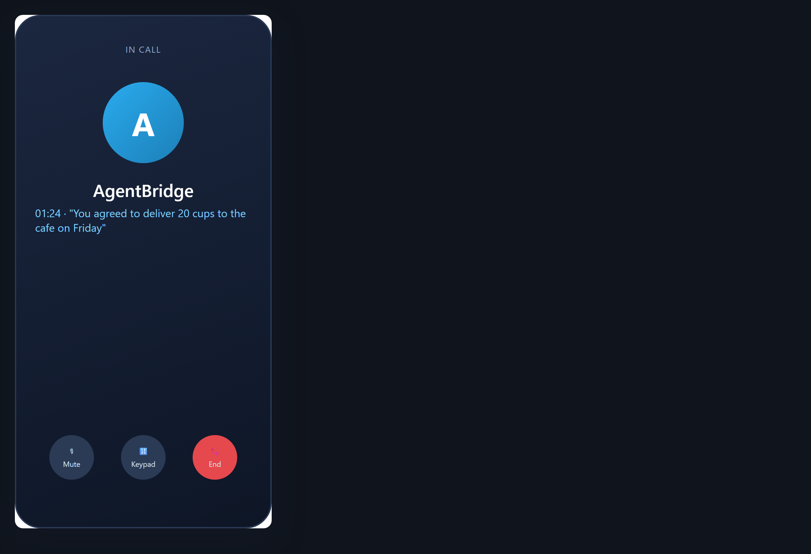

# Call your assistant on the phone

**Tool:** Phone access (SIP) · **How you reach it:** Phone call

## The situation
You are out and need your assistant. You call a number and talk to it like a person.

## What you ask the agent
```text
(phone) What did I agree to deliver to the cafe this week?
```



## What AgentBridge does
You call in, say what you need, and the agent answers from your notes and documents — by voice, wherever you are.

## Good to know
Phone access is protected by a PIN, so only you can reach your assistant.

---
*Part of the **Automate Your Business with AI** example library. The full book is free — see the [examples README](../../README.md).*
