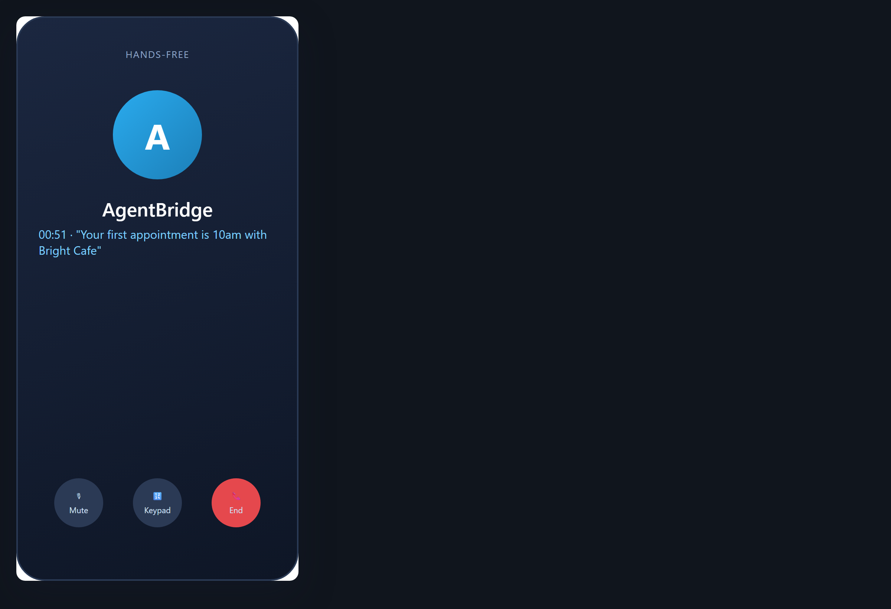

# Hands-free on the road

**Tool:** Phone + voice · **How you reach it:** Phone call

## The situation
You are driving and remember something you need from the office. You call and ask, hands-free.

## What you ask the agent
```text
(phone) Read me my appointment list for today.
```



## What AgentBridge does
The agent reads your appointments over the phone so you stay focused on the road and still have your day in hand.

## Good to know
Keep calls short and focused while driving; save the long work for later.

---
*Part of the **Automate Your Business with AI** example library. The full book is free — see the [examples README](../../README.md).*
