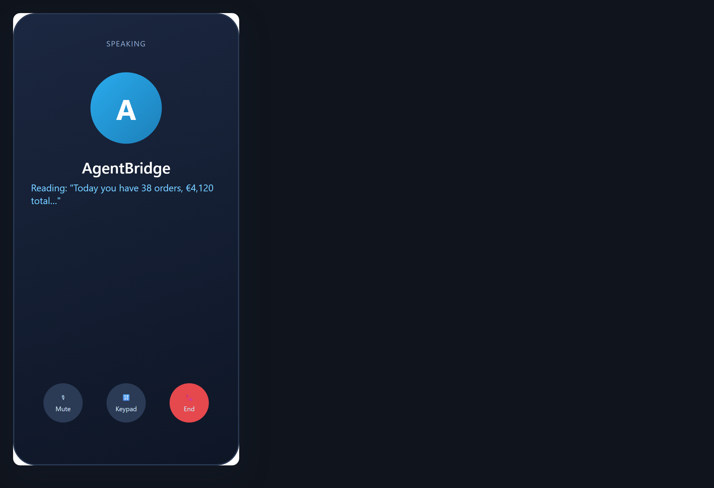

# Let the agent read it to you

**Tool:** Voice (text-to-speech) · **How you reach it:** Voice output

## The situation
You would rather hear the answer than read a long message.

## What you ask the agent
```text
Read me the summary of today's orders out loud.
```



## What AgentBridge does
The agent reads the answer in a clear voice. Useful when you are moving, cooking, or your eyes are tired.

## Good to know
You can ask for any answer to be spoken, not just summaries.

---
*Part of the **Automate Your Business with AI** example library. The full book is free — see the [examples README](../../README.md).*
