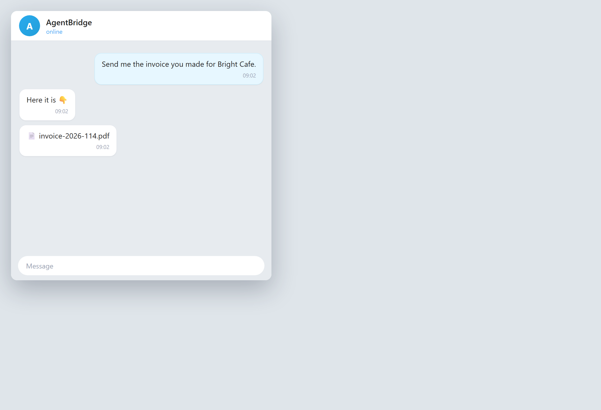

# Get a document on your phone

**Tool:** Telegram + documents · **How you reach it:** Telegram chat

## The situation
You asked for a report at your desk and want it on your phone now.

## What you ask the agent
```text
(telegram) Send me the invoice you made for Bright Cafe.
```



## What AgentBridge does
The agent sends the file into your Telegram chat. Open it, forward it, or download it — right from your phone.

## Good to know
You can ask for any document you made earlier and have it sent to you.

---
*Part of the **Automate Your Business with AI** example library. The full book is free — see the [examples README](../../README.md).*
