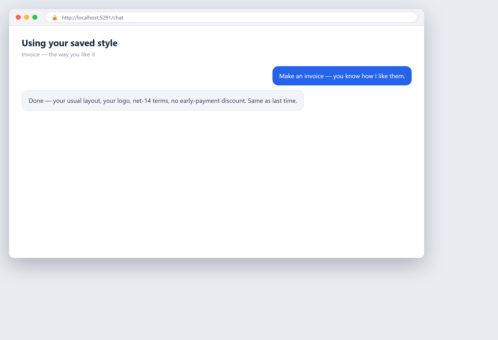

# It remembers how you like things

**Tool:** Agent memory · **How you reach it:** Chat message

## The situation
You told the agent once how you like your invoices. Next time, it just does it that way.

## What you ask the agent
```text
Make an invoice — you know how I like them.
```



## What AgentBridge does
The agent remembers your style and settings from before and applies them without you repeating yourself.

## Good to know
You can correct it any time; it updates what it remembers.

---
*Part of the **Automate Your Business with AI** example library. The full book is free — see the [examples README](../../README.md).*
