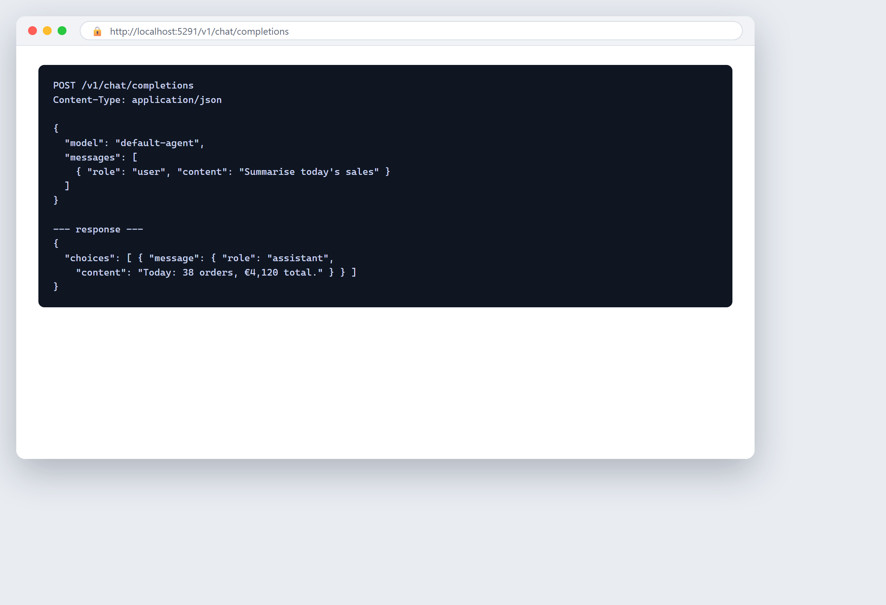

# Plug it into your own tools

**Tool:** HTTP API · **How you reach it:** Developer / API

## The situation
You have a small app or script and want it to use the assistant. There is a simple web API for that.

## What you ask the agent
```text
POST /v1/chat/completions  { "model": "default-agent", "messages": [...] }
```



## What AgentBridge does
Your own programs can call the assistant through a standard web API, the same way they would call any online service. One integration, many uses.

## Good to know
This is for the technical step — the book's connecting chapter walks through it.

---
*Part of the **Automate Your Business with AI** example library. The full book is free — see the [examples README](../../README.md).*
