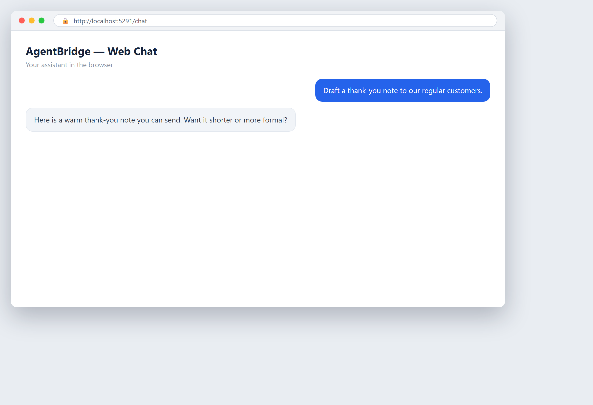

# The same assistant in your browser

**Tool:** Web chat · **How you reach it:** Browser

## The situation
You prefer a browser window over the terminal. The same assistant is there, on any computer you own.

## What you ask the agent
```text
(browser) Draft a thank-you note to our regular customers.
```



## What AgentBridge does
Open the web address and chat in the browser. Same tools, same documents, same memory — just a different window.

## Good to know
Handy when you are on a different machine but still want your own assistant.

---
*Part of the **Automate Your Business with AI** example library. The full book is free — see the [examples README](../../README.md).*
